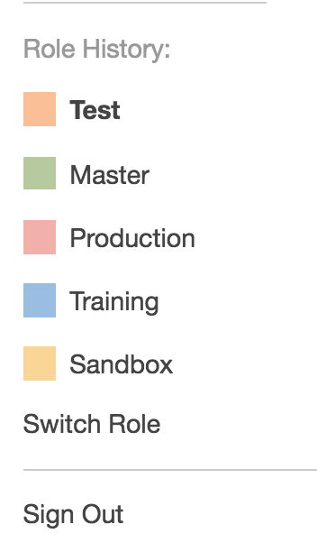
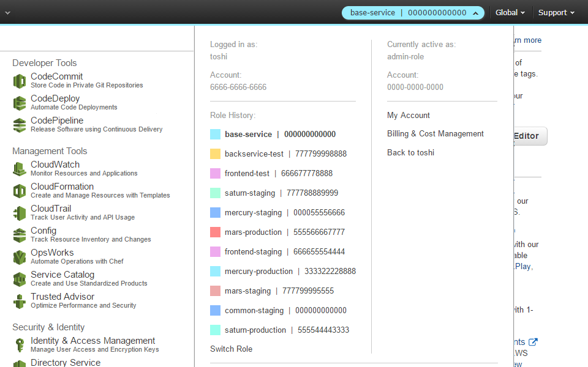

# Easily Switch Between Multiple AWS Accounts

## Introduction

If you use the AWS (GUI) console to manage multiple AWS accounts or IAM Roles, you may have noticed that the Account drop-down menu lists your five most recently used
(MRU) IAM Roles and lets you conveniently switch between them. The MRU account
menu works really well if you sign into a main identity account and then assume
an IAM Role in one or more resource accounts, e.g. dev, test, prod.



But the AWS account drop-down menu has limitations. Besides being limited to the
last five Roles, you cannot filter Roles by account. In other words, if you
have five work accounts and two personal AWS accounts and you frequently switch
between them, your work and personal Roles will be shown together in the order you last accessed them. As consultants who deal with many different customer accounts we need a better solution, and you may too.

In this post I'll show you how to use _"AWS Extend Switch Roles"_, a
[Chrome](https://chrome.google.com/webstore/detail/aws-extend-switch-roles/jpmkfafbacpgapdghgdpembnojdlgkdl)
or
[Firefox](https://addons.mozilla.org/en-US/firefox/addon/aws-extend-switch-roles3/)
extension which extends the number of IAM Roles beyond five and lets you create
groups of related AWS accounts/Roles. For example, when you logon to your
Identity account at work, the Account drop-down menu will only show work-related Roles, e.g. dev, test, prod; your personal accounts will not be shown.

## Extension Configuration

Once you have _"AWS Extend Switch Roles"_ installed, you need to configure it
with your AWS accounts and Roles. Click on the green key icon in your browser
toolbar and select **Configuration**. In the Configuration box you specify a
main identity account and one or more resource accounts. For example:

```INI
[identity]
aws_account_id = 123456789012 or <my_identity_acct_alias>

[dev]
source_profile = identity
role_arn = arn:aws:iam::901234567890:role/app-team-1
region = us-west-2
color = ffcc00

[staging]
source_profile = identity
aws_account_id = my-staging-acct-alias
role_name = app-team-1
region = us-west-2
color = 0096ff

[identity2]
...
```

The extension supports two ways of specifying the IAM role to use for a given
account. You can specify the `aws_account_id` and `role_name` as in the
`[staging]` profile above, or you can specify an AWS `role_arn` which should be
familiar if you already have an `~/.aws/config` file in your home directory for
use with the AWS CLI.

## Not Shared with your `~/.aws/config` file

The _"AWS Extend Switch Roles"_ configuration sure does look a lot like an
`~/.aws/config` file, but they are not the same thing. You'll need to maintain
the Switch Roles configuration separately from your AWS CLI configuration.

## Aliases

The extension allows you to specify either the 12-digit AWS Account Number, or
an [AWS account
alias](https://docs.aws.amazon.com/IAM/latest/UserGuide/console_account-alias.html)
which acts as a friendly name for your account. In the configuration example
above, the Staging account has an account alias of `my-staging-acct-alias`. I
recommend AWS account aliases since it's much easier to tell at a glance which
account you are in.

Keep in mind that you can't use the AWS account alias in an ARN, so if you
specify the `role_arn` format above, you'll need to use your 12-digit AWS
account number.

## Multiple Groups of AWS Accounts/Roles

The extension really shines when you have multiple groups of accounts. Maybe you
have multiple work accounts _and_ multiple personal accounts, or maybe you're on
a Cloud Engineering team and have to work a lot of different IAM Roles and
Accounts.

You can simply specify groups of main identity accounts and related resource
accounts in the extension configuration and the extension will automatically
filter resource accounts by their `source_profile` to show you _only_ resource
Roles/Accounts which you can switch to from the Identity account. For example, if
you have Acme Corp's Identity account and dev/test/prod IAM roles *and* Beyond
Corp's Identity account and dev/staging/prod IAM roles in the Switch Roles
configuration, then only Acme Corp's dev/test/prod IAM roles will be available
when you are signed in to Acme Corp's Identity account.

## AWS Extend Switch Roles Appearance

Here's an example Role menu:



## Summary

I learned about _"AWS Extend Switch Roles"_ from one of our customers and
now I use it every day. I've also demoed it to our engineering team where it was
received enthusiastically. It's a big improvement over the standard AWS account
drop-down menu for managing lots of AWS accounts. If you are a Chrome or Firefox
user, I highly recommend you give it a try.

If you need help managing all those AWS accounts we're happy to help. Send us an
email at <a href="mailto:info@1strategy.com">info@1strategy.com</a>.